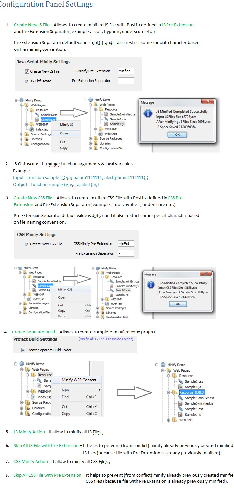
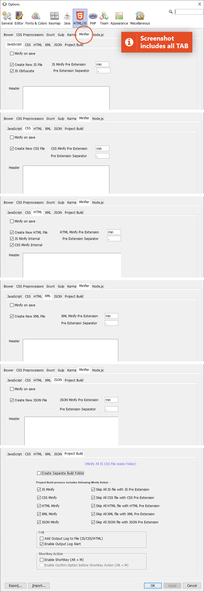

# MinifierBeans 

   

## Description

Plugin to minify JS , CSS and HTML for quicker page load times by reducing the size of js/css/html files.
This plugin remove all unnecessary characters from source code, without changing its functionality. These unnecessary characters usually include white space characters, new line characters, comments, and sometimes block delimiters, which are used to add readability to the code but are not required for it to execute.

- To minify all js , css or html , right click on folder in netbeans and select Minify WEB Content option ; it will minify all css & js file.
- To minify single js/css/html file , right click on js/css/html file in netbeans and select Minify JS/CSS/HTML option to minify file.

Also optimize by compressing image PNG/JPEG (Currently Supported format) and provides other functionality such as image Base64 Encoder/Decoder .

## Compiler used

#### JS - Google Closure Compiler
#### CSS - YUI Compressor (Unmaintained)
#### HTML/CML - HTML Compressor
#### JSON - Custom implementation
#### Images - Image Compressor

## What does it do?

##### 1- Minify JS File
##### 2- Minify JS Source Code Snippet by selecting in editor
##### 3- Minify CSS File
##### 4- Minify CSS Source Code Snippet by selecting in editor
##### 5- Minify HTML File
##### 6- Minify HTML Source Code Snippet by selecting in editor
##### 7- Minify XML File
##### 8- Minify XML Snippet by selecting in editor
##### 9- Minify JSON File
##### 10- Minify JSON Snippet by selecting in editor
##### 11- Log Evaluation Input/Output File Size , Space Reduced Percentage , Total Time Taken ,Individual Log appended to file 
##### 12- Image Base64 Encoder/Decoder
##### 13- Image PNG/JPEG Compress (Currently Supported format)

## Changelog

See [Changelog](./Changelog.md) for all information  

## NetBeans Compatibility

Version < 2.3.0 is compatible to NetBeans 8.2  
Version >= 2.5.1 is compatible to Apache NetBeans >= 9.0  
  
Plugin is available at http://plugins.netbeans.org/plugin/49666/minifierbeans
